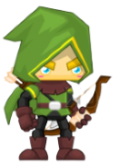
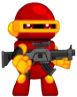
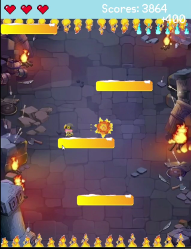

# ***Rapid-Roll***
## **Giới thiệu**

+ Họ và tên: Lê Minh Đạt - K66CD - CN1 - UET - VNU

+ Mã sinh viên: 21020297

+ Bài tập lớn:  **Rapid Roll**  /INT2215 1 - Lập trình nâng cao

## **1. Hướng dẫn cài đặt game**
   + Vào link: https://cutt.ly/nH0u4Nz hoặc tại Github vào nút Code màu xanh lá cây -> Downloads Zip
   + Tải và giải nén file RapidRoll.rar
   + Truy cập theo thứ tự: RapidRoll -> bin -> Debug -> RapidRoll.exe
## **2. Mô tả chung về trò chơi:**
   + Đây là trò chơi thử thách trí nhanh nhạy của người chơi, màn hình sẽ liên tục trôi xuống dưới và người chơi sẽ sử dụng các phím A và D để di chuyển qua các tấm ván, phím J để bắn đạn tiêu diệt quái vật. Nếu không nhanh và khéo léo, bạn sẽ bị rơi xuống, đáp nhầm vào tấm ván có đinh hoặc chạm vào quái vật.
   + Các ý tưởng chính: phát triển từ tựa game Rapid Roll cổ điển, thêm các nhân vật, quái vật, đạn bắn, hiệu ứng nổ,...
   + Có 3 level: Easy, Medium, Hard.
   + Đa dạng nhân vật để người chơi lựa chọn, mỗi nhân vật có một loại đạn tương ứng.

          
   + Thêm 2 loại quái vật đứng im và có di chuyển.
   ### *Preview:*
   -----

   
## **3. Mô tả các chức năng đã cài đặt:**
   + Di chuyển map, di chuyển nhân vật, phát hiện va chạm, tạo quái vật, bắn đạn, vụ nổ khi bắn trúng quái, ăn thêm mạng, bất tử sau khi vừa chết, chọn level, chọn nhân vật, điểm cao nhất, chơi lại, ... 
   + Link Youtube: https://youtu.be/_OzNswpq2BU
## **4. Các kỹ thuật lập trình được sử dụng trong chương trình:**
   + Thư viện SDL2
   + Con trỏ, truyền tham chiếu, tham trị
   + Kỹ thuật tách file, tạo thư viện
   + Dùng mảng, vector, class để quản lý các đối tượng
   + Xử lý hình ảnh, âm thanh, text
   + Nhập dữ liệu từ file bên ngoài
## **5. Kết luận, hướng phát triển và các điều tâm đắc rút ra được sau khi hoàn thiện chương trình**
   + Kết luận:
      1. Hoàn chỉnh các chức năng cơ bản của game: di chuyển, rơi, tạo map, va chạm với map, tạo đạn cho nhân vật, tạo quái vật di chuyển và đứng yên, thêm âm thanh, text, ...
      2. Còn hạn chế trong việc thiết kế đồ họa, đa dạng chức năng cho menu.
   + Hướng phát triển:
      1. Thêm các chức năng cho menu như điều chỉnh âm lượng, nhập tên, back từ phần chọn level và character về menu, thêm danh sách và tên các người chơi có điểm cao nhất.
      2. Thêm chế độ 2 người chơi, hướng đến tựa game đối kháng.
      3. Cải thiện đẹp hơn cho phần đồ họa.
      4. Thiết kế các map khác nhau cho từng độ khó.
      5. Đóng gói thành file exe để dễ dàng hơn trong việc cài đặt.
   + Các điều tâm đắc rút ra sau khi hoàn thiện chương trình:
      1. Học được cách cài thư viện ngoài vào code
      2. Biết cách sử dụng các hàm của thư viện SDL, SDL_img, SDL_ttf, SDL_mixer
      3. Học được cách xử lý fps cho game.
      4. Biết quản lý các đối tượng, truyền dữ liệu một cách chính xác.
      5. Nhận thấy được các mặt hạn chế cần cố gắng của bản thân.
      
